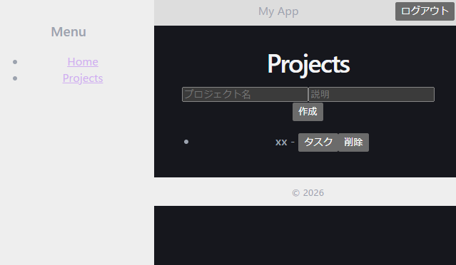
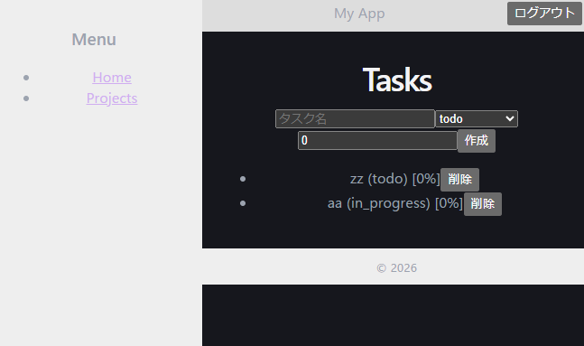

# 業務管理アプリ（Gyoumu App）

## 概要

プロジェクト単位でタスクを管理できる業務アプリです。
JWT認証を用いたAPI設計と、フロント・バックエンドの責務分離を意識して構築しました。

実務を想定し、以下を重視しています：

* 認証を含めたセキュアなAPI設計
* フロントとバックの疎結合構成
* スケーラブルなディレクトリ設計

---

## 技術選定の理由

### フロントエンド

React + Vite→ 高速な開発環境とコンポーネントベース設計のため

Axios→ interceptorによる認証トークンの一元管理が可能

### バックエンド

Django REST Framework→ CRUDだけでなく権限管理・拡張性を考慮

SimpleJWT→ ステートレスな認証を実現し、スケーラビリティを担保

### インフラ 

Docker→ 環境差異の排除

PostgreSQL→ 本番運用を想定したRDB選定

---

## https://gyoumu-furonto.onrender.com

## アーキテクチャ
フロントエンドとバックエンドを完全分離
REST APIで通信
ViewSet / generics を用途に応じて使い分け
権限クラスでアクセス制御を実装
URL設計はRESTfulを意識

## 認証設計

JWT認証を採用し、以下のフローで管理：

ログイン時にaccess / refreshトークンを発行
フロントでトークンを保持
Axios interceptorで自動付与

## 実装上の工夫
Axios interceptorによる認証処理の共通化
APIバージョニング（/api/v1/）による将来拡張性確保
プロジェクト配下にタスクを持たせるドメイン設計

## 課題と改善
### 課題
リフレッシュトークンの自動更新未実装
UI/UXの最適化不足
### 改善案
トークン自動更新ロジックの実装（silent refresh）
コンポーネント分割と状態管理の最適化

## 今後の展望
RBAC（ロールベースアクセス制御）の導入
WebSocketによるリアルタイム更新